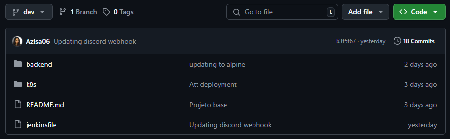
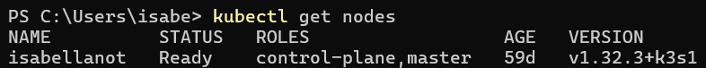
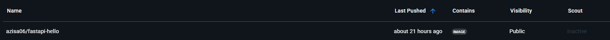
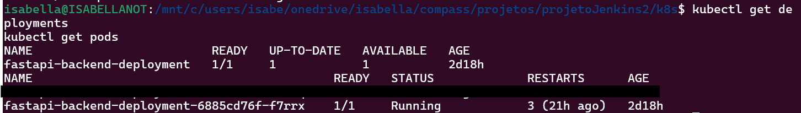
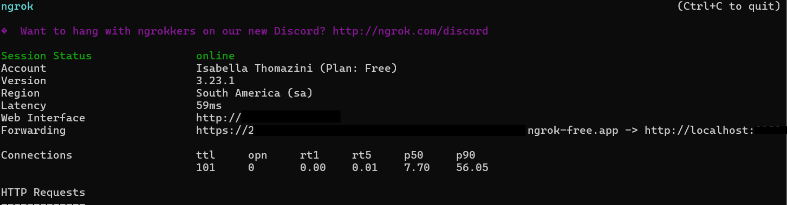
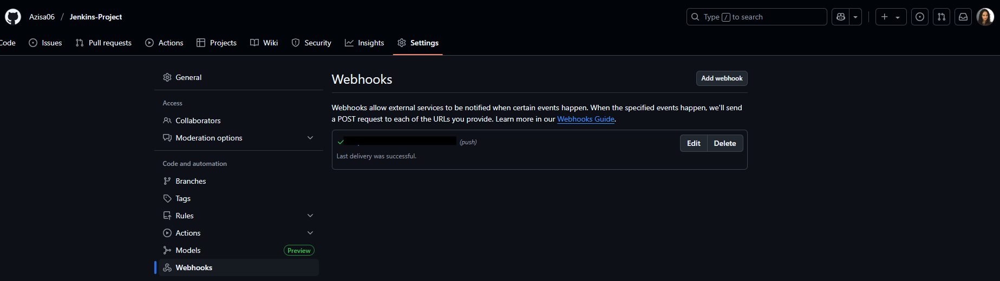
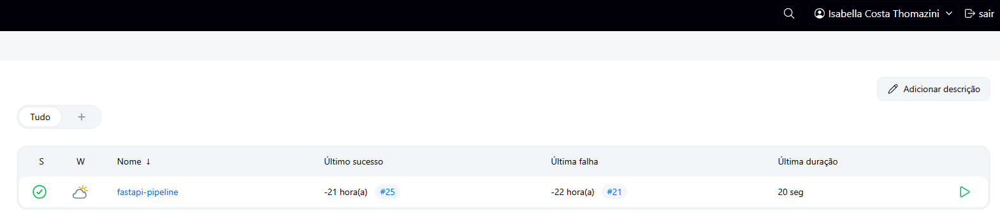
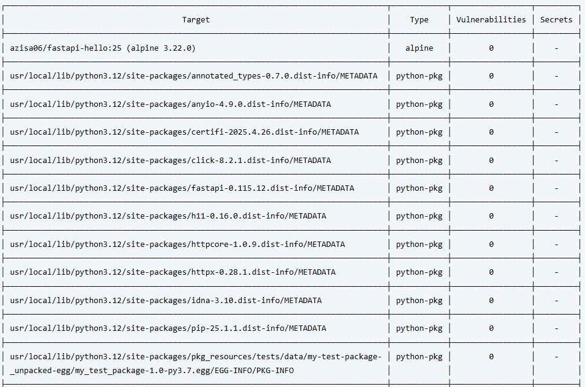
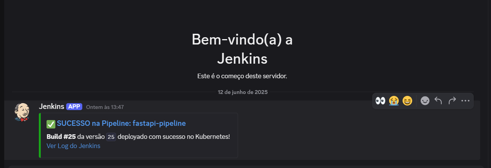

# Projeto DevOps: Automatizando Deploy de APIs com Jenkins e Kubernetes

## Visão Geral do Projeto

Este projeto demonstra a construção de um pipeline de CI/CD completo, focado na automação do deploy de uma aplicação de backend desenvolvida com FastAPI. A jornada de automação abrange desde o versionamento do código até a implantação em um cluster Kubernetes local, incorporando práticas de segurança e notificação para uma esteira de desenvolvimento robusta e eficiente.

## Ferramentas e Tecnologias Essenciais

* **GitHub**: Plataforma de versionamento de código, utilizada para gerenciar o controle de versão da aplicação e o `Jenkinsfile`.
* **FastAPI**: Um framework web Python moderno e de alto desempenho, que serve como base para a aplicação de backend.
* **Docker**: Tecnologia de conteinerização para empacotar a aplicação e suas dependências, garantindo portabilidade entre ambientes.
* **Docker Hub**: Repositório de imagens Docker na nuvem, onde as imagens construídas da aplicação são armazenadas e disponibilizadas.
* **Jenkins**: Servidor de automação de código aberto, central para a orquestração de todo o pipeline de CI/CD.
* **Kubernetes (Rancher Desktop)**: Orquestrador de contêineres que gerencia a implantação e escalabilidade da aplicação em um cluster local (simulado por ferramentas como Rancher Desktop, Minikube ou Kind).
* **Uvicorn**: Servidor ASGI leve e rápido, responsável por servir a aplicação FastAPI.
* **Trivy**: Uma ferramenta de análise de segurança para imagens de contêiner, que identifica vulnerabilidades em dependências de SO e de linguagens de programação.
* **ngrok**: Utilitário que cria túneis seguros da internet pública para serviços rodando localmente, essencial para a integração de webhooks como o do GitHub.
* **Discord**: Plataforma de comunicação utilizada para receber notificações em tempo real sobre o status e os eventos da pipeline de deploy.

## Detalhamento das Fases do Projeto

### Fase 1: Configuração do Ambiente Inicial

Esta etapa fundamental consistiu na preparação do ambiente de desenvolvimento, garantindo que todas as ferramentas básicas estivessem operacionais e configuradas para o início do projeto.
* Configuração do repositório de código no GitHub e clonar a seguinte aplicação de exemplo:

https://github.com/box-genius/projeto-kubernetes-pb-desafio-jenkins/blob/main/backend/main.py

* Estabelecimento da estrutura de branches no GitHub, com `dev` para desenvolvimento e `main` como branch de produção.

   

* Criação e validação da conta no Docker Hub para hospedagem de imagens.

* Verificação do acesso e funcionamento do cluster Kubernetes local, utilizando o Rancher Desktop. No caso do Windows, utilize este comando:
```bash
    kubectl get nodes
```

A saída deve ser algo parecido com isso:
   

* Teste de execução local da aplicação FastAPI com o servidor Uvicorn, confirmando sua funcionalidade.
```bash
    pip install fastapi uvicorn
```

Navegar até o diretório onde foi clonado a aplicação de exemplo e executar com o Univorn:
```bash
    uvicorn main:app --reload
```

Após executar o comando, você deverá ver uma saída no terminal indicando que o Uvicorn iniciou o servidor. Ele mostrará algo como:
```bash
    INFO:     Uvicorn running on http://127.0.0.1:8000 (Press CTRL+C to quit)
    INFO:     Started reloader process [xxxxx]
    INFO:     Started server process [xxxxx]
    INFO:     Waiting for application startup.
    INFO:     Application startup complete.
```

### Fase 2: Conteinerização da Aplicação

Nesta fase, a aplicação de backend foi empacotada em um contêiner Docker, tornando-a portátil e isolada.
* Desenvolvimento de um `Dockerfile` para a aplicação FastAPI, especificando suas dependências e ambiente de execução.
> [!NOTE]\
> Fiz uma pequena modificação no Dockerfile da aplicação base, escolhi usar essa versão do Python: 'python:3.12-alpine', para futuramente facilitar a utilização do Trivy.

* Processo de build da imagem Docker, gerando uma imagem conteinerizada da aplicação.
Navegue até o diretório da aplicação e execute este comando:

```bash
docker build -t seu_usuario_dockerhub/fastapi-hello:latest .
```

* Fazer o Push da Imagem Docker do Backend para o Docker Hub
Primeiro faça o login no Docker Hub:
```bash
docker login
```
Depois faça o push da imagem:
```bash
docker push seu_usuario_dockerhub/fastapi-hello:latest
```

E então você terá sua imagem publicada no DockerHub:
   

### Fase 3: Implantação Manual no Kubernetes

Foram definidos os manifestos do Kubernetes para descrever como a aplicação deve ser implantada e exposta no cluster.
* Criação de um `Deployment` para gerenciar as réplicas da aplicação no Kubernetes, juntamente a um `Service` do tipo `NodePort`, para servir a aplicação via `localhost`.

* Aplicação manual desses manifestos ao cluster Kubernetes.

Navegue até o diretório onde os arquivos .yaml estão salvos e dê o seguinte comando:

```bash
kubectl apply -f deployment-backend.yaml
```

Verifique se o deployment está rodando:
```bash
kubectl get deployments
kubectl get pods
```

   

### Fase 4: Jenkins como Orquestrador de CI/CD

O Jenkins foi introduzido para automatizar as etapas de build e push das imagens.

* Baixar o Jenkins na sua máquina.

* Baixar o Ngrok na sua máquina (será usado no webhook do GitHub)

* Criação de um Jenkinsfile (os comandos em meu Jenkinsfile são para windows).

* Cadastre as credenciais necessárias nas configurações do Jenkins.
Cadastrei credenciais para o DockerHub e Kubeconfig.

* Acesse o Jenkins através da URL fornecida pelo Ngrok ao dar o seguinte comando:
```bash
ngrok http 30001
```

    

* Instalação e configuração inicial do Jenkins, incluindo plugins essenciais para integração com Git e Docker.
Baixar os seguintes plugins:   
1 - Docker Pipeline   
2 - Docker plugin   
3 - Kubernetes CLI plugin   
4 - Discord Notifier (será usado futuramente no webhook com Discord).   

* Criação de um pipeline `Declarative` no Jenkins, definido por um `Jenkinsfile` versionado no Git.

* Configuração de um webhook no GitHub para acionar a pipeline automaticamente a cada `git push` para a branch `dev`.

   

* Clique em 'Construir agora' e a build do Job será iniciada.

   

### Fase 5: Automatizando o Deploy com Jenkins

A etapa final do pipeline de CI/CD foi automatizada, permitindo que o Jenkins gerencie a implantação da aplicação no Kubernetes.
* Garantia de que as ferramentas `kubectl` e `powershell` estavam acessíveis no ambiente de execução do Jenkins.
* Configuração de credenciais `kubeconfig` no Jenkins para permitir a comunicação segura com o cluster Kubernetes.
* Adição de um estágio de `Deploy no Kubernetes` no `Jenkinsfile`, que utiliza `kubectl apply` para atualizar a aplicação.
* Validação completa do pipeline, confirmando que a aplicação é automaticamente implantada e funciona corretamente no cluster Kubernetes.

## Desafios Extras Concluídos

### Desafio Extra 1: Análise de Vulnerabilidades com Trivy

Uma camada de segurança foi adicionada ao pipeline, garantindo que as imagens de contêiner sejam verificadas antes da implantação.

* Baixar o Trivy.

* Adicionar este novo estágio ao Jenkinsfile.

* Um novo estágio foi adicionado ao pipeline para executar o scan de vulnerabilidades da imagem Docker após o push para o Docker Hub.

* O pipeline foi configurado para **falhar automaticamente** caso vulnerabilidades com severidade CRÍTICA ou ALTA fossem detectadas, impedindo a implantação de imagens inseguras.

   

* **Resultado:** A imagem base da aplicação foi atualizada com sucesso para `python:3.12-alpine`, resultando em uma **redução a zero de vulnerabilidades críticas e altas**, tornando a imagem muito mais segura.

### Desafio Extra 2: Notificações de Pipeline no Discord

Para melhorar a visibilidade e a comunicação do status do pipeline, foram configuradas notificações automáticas.

* Criação de um webhook no Discord para um canal específico de notificações.

* Instalação e configuração do plugin `Discord Notification` no Jenkins (já foi mencionado acima).

* Implementação de passos no bloco `post` do `Jenkinsfile` para enviar mensagens detalhadas de sucesso ou falha da pipeline para o canal do Discord.
* **Resultado:** As notificações estão funcionando, fornecendo feedback instantâneo sobre o status dos builds e deploys.

   